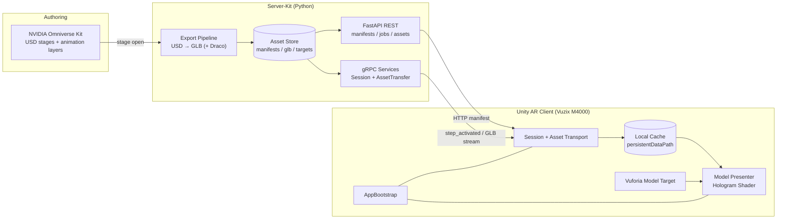
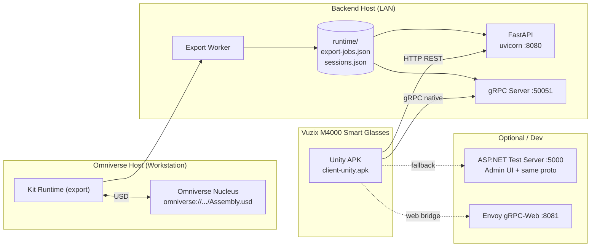
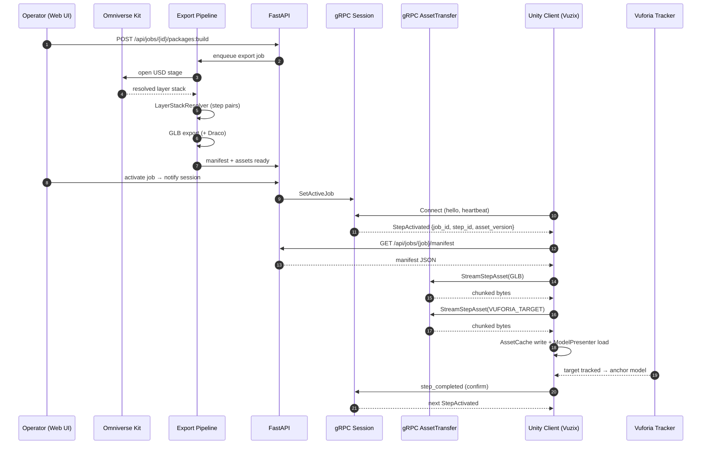
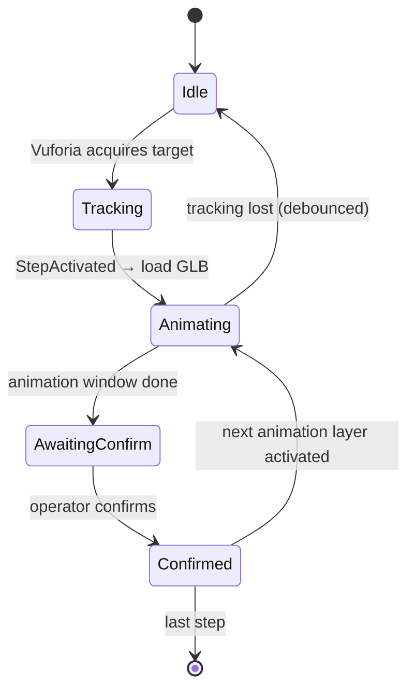
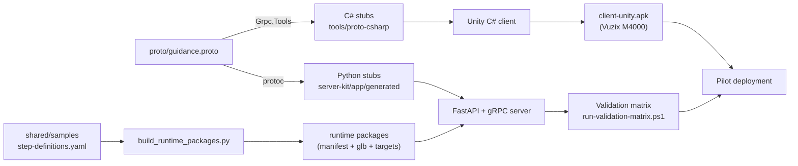

# Omniverse → Unity AR Worker Guidance — Architecture

End-to-end architecture for the AR worker guidance system: assembly animations authored in **NVIDIA Omniverse**, exported through a **FastAPI / Python Server-Kit**, streamed via **gRPC** to a **Unity 6 client** deployed on **Vuzix M4000** smart glasses.

---

## 1. System at a Glance



---

## 2. Layered View

```mermaid
flowchart TB
    subgraph L1["① Content Layer — Omniverse"]
        A1["USD Assembly Stage"]
        A2["Animation Layers<br/>(per-part movement)"]
        A3["Target-Position Layers"]
    end

    subgraph L2["② Export Layer — Python Server-Kit"]
        B1["Stage Open Service"]
        B2["Layer Stack Resolver<br/>(BTU step handover)"]
        B3["GLB Exporter<br/>(Omniverse / Passthrough)"]
        B4["Draco Codec (optional)"]
        B5["Manifest Service"]
        B6["Export Job Queue + Worker"]
    end

    subgraph L3["③ Delivery Layer — Transports"]
        C1["FastAPI REST :8080<br/>manifests, jobs, packages"]
        C2["gRPC Session :50051<br/>duplex stream"]
        C3["gRPC AssetTransfer :50051<br/>chunked GLB / target"]
        C4["HTTP Bridge fallback"]
    end

    subgraph L4["④ Client Layer — Unity 6"]
        D1["AppBootstrap / RuntimeContext"]
        D2["SessionClient + Transport"]
        D3["Manifest + Asset Clients"]
        D4["AssetCache / TargetPayloadCache"]
        D5["ModelPresenter + Hologram"]
        D6["StepCoordinator state machine"]
    end

    subgraph L5["⑤ Device Layer — Vuzix M4000"]
        E1["Android ARM64 / IL2CPP"]
        E2["Vuforia Model Target tracking"]
        E3["HUD overlay"]
    end

    L1 --> L2 --> L3 --> L4 --> L5
```



---

## 3. Deployment Topology



---

## 4. End-to-End Pipeline



---

## 5. Step Handover Logic (BTU Layer Model)



Per part the server resolves **two paired layers**: an *animation* layer (movement window) and a *target-position* layer (final pose). Confirmation un-mutes the target-position layer and activates the next animation layer — deterministic, cache-keyed.

---

## 6. Component Map (Condensed)

| Layer | Module | Path |
|-------|--------|------|
| Omniverse | Stage open service | [server-kit/app/stage_open_service.py](server-kit/app/stage_open_service.py) |
| Export | Layer resolver | [server-kit/app/layer_stack_resolver.py](server-kit/app/layer_stack_resolver.py) |
| Export | GLB exporter | [server-kit/app/glb_exporter.py](server-kit/app/glb_exporter.py) |
| Export | Draco codec | [server-kit/app/draco_codec.py](server-kit/app/draco_codec.py) |
| Export | Job service / worker | [server-kit/app/export_job_service.py](server-kit/app/export_job_service.py), [export_worker_main.py](server-kit/app/export_worker_main.py) |
| API | FastAPI entry | [server-kit/app/server_kit_main.py](server-kit/app/server_kit_main.py) |
| API | Manifest service | [server-kit/app/manifest_service.py](server-kit/app/manifest_service.py) |
| gRPC | Session service | [server-kit/app/grpc_session_service.py](server-kit/app/grpc_session_service.py) |
| gRPC | Asset transfer | [server-kit/app/grpc_asset_service.py](server-kit/app/grpc_asset_service.py) |
| Proto | Contract | [proto/guidance.proto](proto/guidance.proto) |
| Unity | Bootstrap | `client-unity/Assets/App/Runtime/AppBootstrap.cs` |
| Unity | Session transport | `client-unity/Assets/App/Networking/GrpcSessionTransport.cs` |
| Unity | Asset transport | `client-unity/Assets/App/Networking/GrpcAssetTransferClient.cs` |
| Unity | Cache | `client-unity/Assets/App/Caching/AssetCache.cs` |
| Unity | Presenter | `client-unity/Assets/App/Gltf/ModelPresenter.cs` |
| Unity | Vuforia bridge | `client-unity/Assets/App/Vuforia/VuforiaTrackingBridge.cs` |

---

## 7. Key Design Properties

| Property | Implementation |
|---|---|
| Zero embedded assembly data | Editor pre-build check forbids `.glb` / `.dat` / `.xml` / `.manifest.json` inside Unity `Assets/` |
| Deterministic step progression | `confirm → next` enforced by server `LayerStackResolver` with stable cache keys |
| Reconnect-safe sessions | Periodic heartbeats + session-store persistence (`sessions.json`) |
| Dual transport | Native gRPC default, HTTP bridge fallback for restricted runtimes |
| Immutable, versioned assets | Manifests reference `asset_version` / `target_version`; client cache keyed by version |
| Pluggable export backend | `PassthroughGlbExporter` for dev, `OmniverseStageGlbExporter` for Kit |
| Observability | JSON structured logs (`session_id`, `step_id`, `correlation_id`), diagnostics export |
| Mobile gRPC on Android IL2CPP | `Grpc.Net.Client` + `YetAnotherHttpHandler` (HTTP/2) |

---

## 8. Ports & Protocols

| Port | Protocol | Purpose |
|------|----------|---------|
| `8080` | HTTP/REST | Manifests, job control, package build, stage smoke |
| `50051` | gRPC/HTTP2 | `GuidanceSessionService` + `AssetTransferService` |
| `5000` | HTTP + gRPC | ASP.NET test server (admin UI + same proto) |
| `8081` | gRPC-Web | Envoy gateway (experiments only) |

---

## 9. Environment Surface (Selected)

```
GUIDANCE_STAGE_URI=omniverse://localhost/Projects/Assembly.usd
GUIDANCE_DRACO_ENABLED=true
GUIDANCE_DRACO_TOOLCHAIN=gltf-transform
GUIDANCE_EXPORT_JOB_PROCESSING_MODE=enqueue-only
GUIDANCE_EXPORT_JOB_STORE_FILE=./server-kit/runtime/export-jobs.json
GUIDANCE_SESSION_STORE_FILE=./server-kit/runtime/sessions.json
```

---

## 10. Build & Release Pipeline



---

*Generated as living documentation. Update alongside changes to `proto/guidance.proto`, server-kit modules, or Unity runtime composition.*
